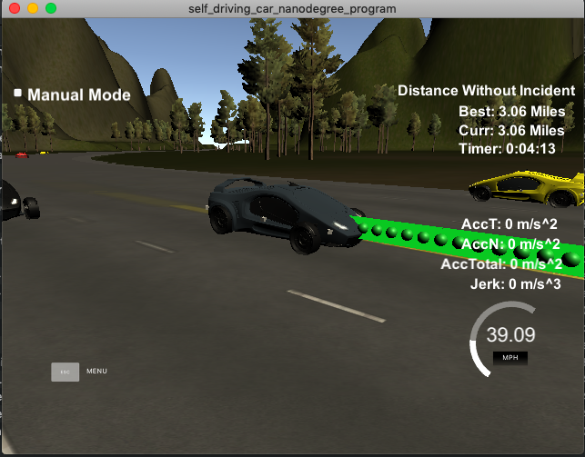

# CarND-Path-Planning-Project
Self-Driving Car Engineer Nanodegree Program

# CarND-Path-Planning-Project
Self-Driving Car Engineer Nanodegree Program

**Reflection**

Frenet coordinate transformations along with spline interoplation was used to safely navigate the car on a highway track. Using Frenet coordinates specifies which lane the car should be in (the ***d*** Frenet coordinate which is the distance from the center of the road which corresponds to the lane the car is in), as well as how far down the road (the ***s*** Frenet coordinate which is the distance from the center of the road which corresponds to the car's distance along the highway).

Widely spaced highway map waypoints caused its Frenet outline to be jagged, consisting of line segments with sharp corners. Interoplation, using ***spline.h*** was used to counter the sharp acceleration and non-linearity of the Frenet transformation. ***Spline.h*** smoothed out the path planning path.

Three widely spaced Frenet points were used with dynamic d based on the desired lane, and with s values spaced 30m [main.cpp at line 415]. This smoothes the car's projected path and no max acceleration or jerk values are flagged during the run. 

Ensuring the car could speed up and slow down at a constant acceleration that was less than 10 m/s^2, was accomplished by by a reference velocity that was always incremented or decremented by a constant value that resulted in plus or minus 5 m/s^2 [main.cpp at line 471] . In order for the ego vehicle to travel at the reference velocity the spline needed to be split into evenly spaced points, where the car would transverse through each point every .02 seconds. To do this the three anchor points where converted to the local vehicle coordinate space where the math was easier to use, and then spline could be linearly approximated with its distance and then the number of spaces could be calculated [main.cpp at line 479].

With no cars in front of the ego vehicle, the reference speed was 49.5 MPH, otherwise the car will slow down and explore a lane change. Sensor fusion data allowed the ego vehicle to see all other traffic, each car's Frenet values were used to see if it was in the same lane as the ego car and then how close it was[main.cpp at line 330]. Frenet values were used both for detecting traffic car in front of the ego vehicle as well as seeing if a lane change was safe. If a lane change was safe the ego vehicle simply would change its lane and the spline interoplation would make the lane change smooth [main.cpp at line 355 and line 377].

The lane change logic was quite simple, if there was a car in front of the ego vehicle then it would see if it was safe to change to the left lane, if the left lane was not safe then it would try to change to the right lane. The car was able to go > 10 miles around the highway without any incidents in a little more than 10 minutes (The Simulator was stopped after 10:14 minutes).

### Please find a YouTube snippet of the the car driving on a Highway in the Simulator below:

](https://youtu.be/5_LmYiq4SGw)
   
### Simulator.
You can download the Term3 Simulator which contains the Path Planning Project from the [releases tab (https://github.com/udacity/self-driving-car-sim/releases/tag/T3_v1.2).

### Goals
In this project your goal is to safely navigate around a virtual highway with other traffic that is driving +-10 MPH of the 50 MPH speed limit. You will be provided the car's localization and sensor fusion data, there is also a sparse map list of waypoints around the highway. The car should try to go as close as possible to the 50 MPH speed limit, which means passing slower traffic when possible, note that other cars will try to change lanes too. The car should avoid hitting other cars at all cost as well as driving inside of the marked road lanes at all times, unless going from one lane to another. The car should be able to make one complete loop around the 6946m highway. Since the car is trying to go 50 MPH, it should take a little over 5 minutes to complete 1 loop. Also the car should not experience total acceleration over 10 m/s^2 and jerk that is greater than 10 m/s^3.

